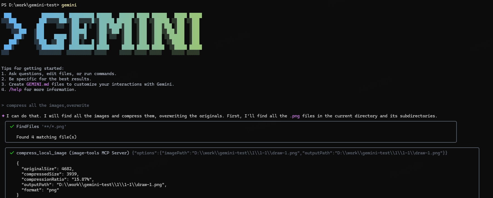
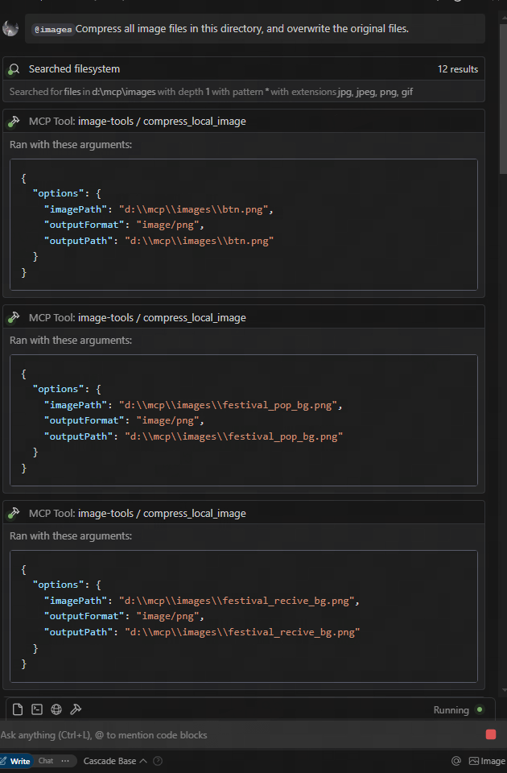
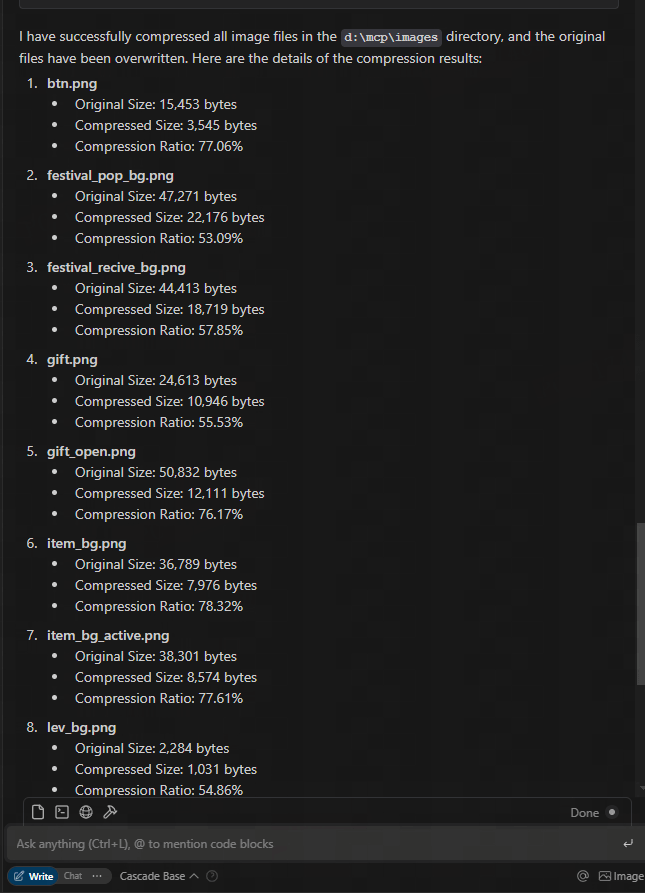

# Image Tools MCP

[](https://smithery.ai/server/@kshern/image-tools-mcp)

A Model Context Protocol (MCP) service for retrieving image dimensions and compressing images, supporting both URL and local file sources.

_[中文文档](./README_zh.md)_

## Features

- Retrieve image dimensions from URLs
- Get image dimensions from local files
- Compress images from URLs using TinyPNG API
- Compress local images using TinyPNG API
- Convert images to different formats (webp, jpeg/jpg, png)
- Returns width, height, type, MIME type, and compression information

### Example Results







download from figma url and compress


## Usage

### Using as an MCP Service

This service provides five tool functions:

1. `get_image_size` - Get dimensions of remote images
2. `get_local_image_size` - Get dimensions of local images
3. `compress_image_from_url` - Compress remote images using TinyPNG API
4. `compress_local_image` - Compress local images using TinyPNG API
5. `figma` - Fetch image links from Figma API and compress them using TinyPNG API

### Client Integration

To use this MCP service, you need to connect to it from an MCP client. Here are examples of how to integrate with different clients:

#### Usage

```json
{
  "mcpServers": {
    "image-tools": {
      "command": "npx",
      "args": ["image-tools-mcp"],
      "env": {
        "TINIFY_API_KEY": "<YOUR_TINIFY_API_KEY>",
        "FIGMA_API_TOKEN": "<YOUR_FIGMA_API_TOKEN>"
      }
    }
  }
}
```

#### Using with MCP Client Library

````typescript
import { McpClient } from "@modelcontextprotocol/client";

// Initialize the client
const client = new McpClient({
  transport: "stdio" // or other transport options
});

// Connect to the server
await client.connect();

// Get image dimensions from URL
const urlResult = await client.callTool("get_image_size", {
  options: {
    imageUrl: "https://example.com/image.jpg"
  }
});
console.log(JSON.parse(urlResult.content[0].text));
// Output: { width: 800, height: 600, type: "jpg", mime: "image/jpeg" }

// Get image dimensions from local file
const localResult = await client.callTool("get_local_image_size", {
  options: {
    imagePath: "D:/path/to/image.png"
  }
});
console.log(JSON.parse(localResult.content[0].text));
// Output: { width: 1024, height: 768, type: "png", mime: "image/png", path: "D:/path/to/image.png" }

// Compress image from URL
const compressUrlResult = await client.callTool("compress_image_from_url", {
  options: {
    imageUrl: "https://example.com/image.jpg",
    outputFormat: "webp" // Optional: convert to webp, jpeg/jpg, or png
  }
});
console.log(JSON.parse(compressUrlResult.content[0].text));
// Output: { originalSize: 102400, compressedSize: 51200, compressionRatio: "50.00%", tempFilePath: "/tmp/compressed_1615456789.webp", format: "webp" }

// Compress local image
const compressLocalResult = await client.callTool("compress_local_image", {
  options: {
    imagePath: "D:/path/to/image.png",
    outputPath: "D:/path/to/compressed.webp", // Optional
    outputFormat: "image/webp" // Optional: convert to image/webp, image/jpeg, or image/png
  }
});
console.log(JSON.parse(compressLocalResult.content[0].text));
// Output: { originalSize: 102400, compressedSize: 51200, compressionRatio: "50.00%", outputPath: "D:/path/to/compressed.webp", format: "webp" }

// Fetch image links from Figma API

const figmaResult = await client.callTool("figma", {
  options: {
    figmaUrl: "https://www.figma.com/file/XXXXXXX"
  }
});
console.log(JSON.parse(figmaResult.content[0].text));
// Output: { imageLinks: ["https://example.com/image1.jpg", "https://example.com/image2.jpg"] }

### Tool Schemas

#### get_image_size

```typescript
{
  options: {
    imageUrl: string // URL of the image to retrieve dimensions for
  }
}
````

#### get_local_image_size

```typescript
{
  options: {
    imagePath: string; // Absolute path to the local image file
  }
}
```

#### compress_image_from_url

```typescript
{
  options: {
    imageUrl: string // URL of the image to compress
    outputFormat?: "image/webp" | "image/jpeg" | "image/jpg" | "image/png" // Optional output format
  }
}
```

#### compress_local_image

```typescript
{
  options: {
    imagePath: string // Absolute path to the local image file
    outputPath?: string // Optional absolute path for the compressed output image
    outputFormat?: "image/webp" | "image/jpeg" | "image/jpg" | "image/png" // Optional output format
  }
}
```

#### figma

```typescript
{
  options: {
    figmaUrl: string; // URL of the Figma file to fetch image links from
  }
}
```

## Changelog

- **2025-05-12:** Updated Figma API to support additional parameters, including 2x image scaling.

## Technical Implementation

This project is built on the following libraries:

- [probe-image-size](https://github.com/nodeca/probe-image-size) - For image dimension detection
- [tinify](https://github.com/tinify/tinify-nodejs) - For image compression via the TinyPNG API
- [figma-api](https://github.com/figma/api) - For fetching image links from Figma API

## Environment Variables

- `TINIFY_API_KEY` - Required for image compression functionality. Get your API key from [TinyPNG](https://tinypng.com/developers)
  - When not provided, the compression tools (`compress_image_from_url` and `compress_local_image`) will not be registered
- `FIGMA_API_TOKEN` - Required for fetching image links from Figma API. Get your API token from [Figma](https://www.figma.com/developers)
  - When not provided, the Figma tool (`figma`) will not be registered

Note: The basic image dimension tools (`get_image_size` and `get_local_image_size`) are always available regardless of API keys.

## License

MIT
