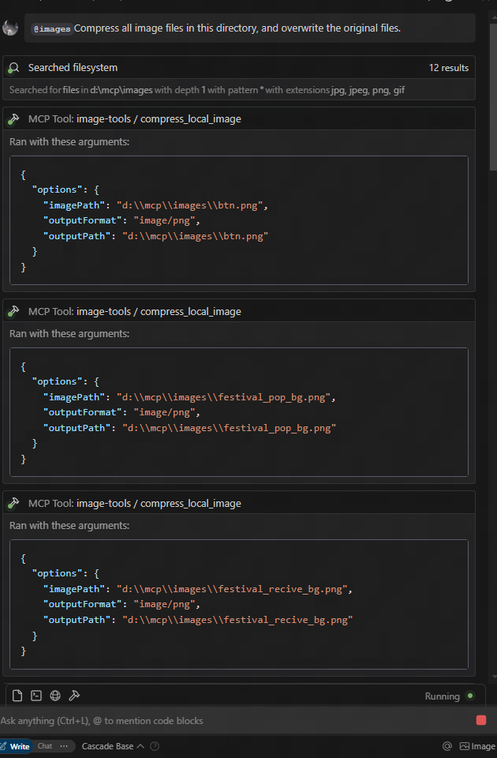
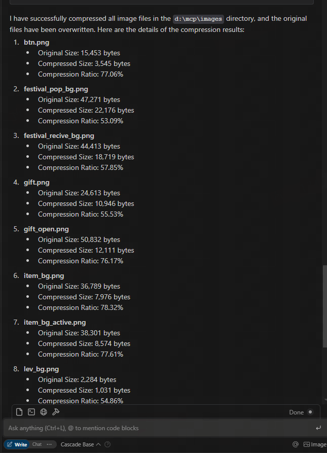
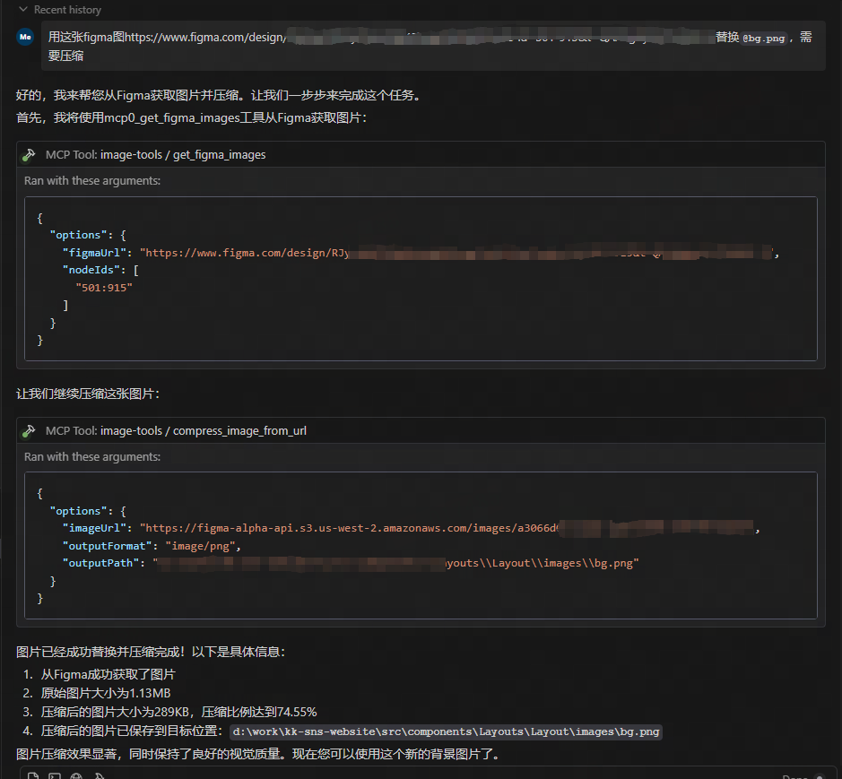

# Image Tools MCP

一个基于 Model Context Protocol (MCP) 的图片工具服务，支持获取图片尺寸和压缩图片，可处理 URL 和本地文件源。

## 功能特点

- 支持从 URL 获取远程图片尺寸
- 支持从本地文件获取图片尺寸
- 使用 TinyPNG API 压缩远程 URL 图片
- 使用 TinyPNG API 压缩本地图片文件
- 支持转换图片格式（webp、jpeg/jpg、png）
- 返回图片的宽度、高度、类型、MIME 类型和压缩信息

### 效果展示






## 使用方法

### 作为 MCP 服务使用

该服务提供了四个工具函数：

1. `get_image_size` - 获取远程图片尺寸
2. `get_local_image_size` - 获取本地图片尺寸
3. `compress_image_from_url` - 使用 TinyPNG API 压缩远程图片
4. `compress_local_image` - 使用 TinyPNG API 压缩本地图片
5. `figma` - 从 Figma API 获取图片链接并压缩

### 客户端集成

要使用此 MCP 服务，您需要从 MCP 客户端连接到它。以下是与不同客户端集成的示例：

#### 与 Claude Desktop 一起使用

1. 从 [claude.ai/download](https://claude.ai/download) 安装 Claude Desktop
2. 获取 TinyPNG API 密钥：访问 [TinyPNG](https://tinypng.com/developers) 并获取 API 密钥
3. 通过编辑配置文件，配置 Claude Desktop 使用此 MCP 服务器：

```json
{
  "mcpServers": {
    "image-tools": {
      "command": "npx",
      "args": ["image-tools-mcp"],
      "env": {
        "TINIFY_API_KEY": "<YOUR_TINIFY_API_KEY>",
        "FIGMA_API_TOKEN": "<YOUR_FIGMA_API_TOKEN>"
      }
    }
  }
}
```

4. 重启 Claude Desktop
5. 请求 Claude 获取图片尺寸："告诉我这张图片的尺寸：https://example.com/image.jpg"
6. 请求 Claude 压缩图片："帮我压缩这张图片：https://example.com/image.jpg"
7. 请求 Claude 压缩本地图片："帮我压缩这张图片：D:/path/to/image.png"
8. 请求 Claude 压缩本地图片："帮我压缩这个文件夹下的图片：D:/imageFolder/"

#### 使用 MCP 客户端库

```typescript
import { McpClient } from "@modelcontextprotocol/client";

// 初始化客户端
const client = new McpClient({
  transport: "stdio", // 或其他传输选项
});

// 连接到服务器
await client.connect();

// 从 URL 获取图片尺寸
const urlResult = await client.callTool("get_image_size", {
  options: {
    imageUrl: "https://example.com/image.jpg",
  },
});
console.log(JSON.parse(urlResult.content[0].text));
// 输出: { width: 800, height: 600, type: "jpg", mime: "image/jpeg" }

// 从本地文件获取图片尺寸
const localResult = await client.callTool("get_local_image_size", {
  options: {
    imagePath: "D:/path/to/image.png",
  },
});
console.log(JSON.parse(localResult.content[0].text));
// 输出: { width: 1024, height: 768, type: "png", mime: "image/png", path: "D:/path/to/image.png" }

// 从 URL 压缩图片
const compressUrlResult = await client.callTool("compress_image_from_url", {
  options: {
    imageUrl: "https://example.com/image.jpg",
    outputFormat: "webp", // 可选：转换为 webp、jpeg/jpg 或 png
  },
});
console.log(JSON.parse(compressUrlResult.content[0].text));
// 输出: { originalSize: 102400, compressedSize: 51200, compressionRatio: "50.00%", tempFilePath: "/tmp/compressed_1615456789.webp", format: "webp" }

// 压缩本地图片
const compressLocalResult = await client.callTool("compress_local_image", {
  options: {
    imagePath: "D:/path/to/image.png",
    outputPath: "D:/path/to/compressed.webp", // 可选
    outputFormat: "image/webp", // 可选：转换为 image/webp、image/jpeg 或 image/png
  },
});
console.log(JSON.parse(compressLocalResult.content[0].text));
// 输出: { originalSize: 102400, compressedSize: 51200, compressionRatio: "50.00%", outputPath: "D:/path/to/compressed.webp", format: "webp" }
```

### 工具模式

#### get_image_size

```typescript
{
  options: {
    imageUrl: string; // 要获取尺寸的图片 URL
  }
}
```

#### get_local_image_size

```typescript
{
  options: {
    imagePath: string; // 本地图片文件的绝对路径
  }
}
```

#### compress_image_from_url

```typescript
{
  options: {
    imageUrl: string // 要压缩的图片 URL
    outputFormat?: "image/webp" | "image/jpeg" | "image/jpg" | "image/png" // 可选的输出格式
  }
}
```

#### compress_local_image

```typescript
{
  options: {
    imagePath: string // 本地图片文件的绝对路径
    outputPath?: string // 可选的压缩后图片的输出绝对路径
    outputFormat?: "image/webp" | "image/jpeg" | "image/jpg" | "image/png" // 可选的输出格式
  }
}
```

## 技术实现

本项目基于以下库实现：

- [probe-image-size](https://github.com/nodeca/probe-image-size) - 用于图片尺寸检测
- [tinify](https://github.com/tinify/tinify-nodejs) - 通过 TinyPNG API 进行图片压缩

## 修改记录

- **2025-05-12:** 更新 Figma API，支持包括 2x 图像缩放在内的额外参数。

## 环境变量

- `TINIFY_API_KEY` - 图片压缩功能所需。从 [TinyPNG](https://tinypng.com/developers) 获取您的 API 密钥
  - 未提供时，压缩工具 (`compress_image_from_url` 和 `compress_local_image`) 将不会被注册
- `FIGMA_API_TOKEN` - Figma API 访问令牌。从 [Figma](https://www.figma.com/developers) 获取您的 API 密钥
  - 未提供时，Figma 工具 (`get_figma_images`) 将不会被注册

注意：基础图片尺寸工具 (`get_image_size` 和 `get_local_image_size`) 始终可用，不受 API 密钥影响。

## 许可证

MIT
